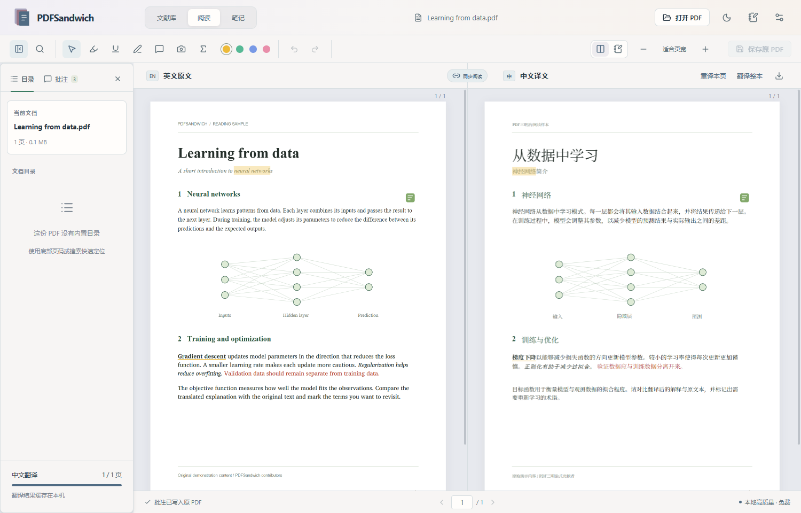
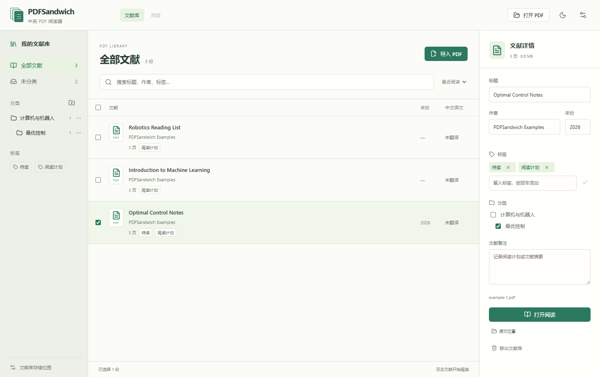

# PDFSandwich

Windows 中英对照 PDF 阅读与批注工具。默认使用免费的本地 HY-MT 专用英译中模型，提供成对的艺术明暗主题、文献库和实时 Markdown 笔记。

[下载 v0.6.1](https://github.com/ASOAT/PDFSandwich/releases/tag/v0.6.1) · [产品介绍](https://asoat.github.io/PDFSandwich/) · [反馈问题](https://github.com/ASOAT/PDFSandwich/issues)



## 使用

从 [GitHub Release](https://github.com/ASOAT/PDFSandwich/releases/latest) 下载 `PDFSandwich-Setup-0.6.1.exe`，适用于 Windows 10 / 11 x64。
安装版不需要安装 Python、Node.js 或配置 API Key。当前安装包未签名，发布页附 SHA-256 校验文件、完整源码包和原创示例 PDF。

1. 在文献库导入或拖入可选中文字的英文 PDF。导入时复制到统一文献库，默认位于软件文件夹下的 `Library`；初始文件保持不变。
2. 左侧原文、右侧中文。默认翻到哪里就优先翻译哪里；即使正在翻译整本，跳页也会让后台任务让出位置，先处理当前页，再继续邻页和剩余任务。
3. 在任一侧滚动，另一侧跟随同一页及页内位置；顶部“同步阅读”可解除联动。
4. 选择高亮、下划线、手绘或批注工具，在任一侧标记。高亮/下划线支持整段、多段和跨页拖选，按页对应并可一次撤销；英文侧未翻译页面的标记会在翻译后补上。中文侧跨页选择要求经过的页面已翻译。文字批注内容保持原样。
5. 点击“保存原 PDF”或按 **Ctrl+S**，将真正的 PDF 批注写回英文原文件。
   保存前自动在原文件旁的 `.pdfsandwich-backups` 目录创建备份。
6. 设置中开启“自动保存中文 PDF”后，每完成页面翻译或修改批注，会更新库内原 PDF 旁的同名 `.zh.pdf`。未翻译页保留英文；也可手动导出中文 PDF 或中英交替页 PDF。

## Markdown 笔记与 Obsidian

- 点击“阅读与笔记设置”，选择独立 Markdown 或 Obsidian Vault。独立模式默认 `软件文件夹/Notes`，可选择自己的文件夹；Obsidian 模式指定 Vault 与笔记子目录。两者使用同一套普通 `.md` 文件，不需要账户或 Obsidian 才能记笔记。
- 阅读工具栏切换“双栏原文译文 / 段落对照 / PDF 与笔记”。笔记栏可收起、拖动宽度，也可打开独立浮动窗口。
- **默认实时编辑**：非当前编辑行直接呈现标题、加粗、斜体、引用、列表、表格、链接、图片和公式；点回相应内容即可修改 Markdown。另提供源码与只读视图。两种存储模式行为相同。
- 每份文献默认关联一篇笔记，含 YAML 标题、作者、年份、DOI、标签和稳定 ID，以及摘要、研究方法、核心结论、个人思考和摘录模板。已有摘要可填入；应用不会自动编造论文结论。
- 选中文字后右键“加入文献笔记”，或在批注菜单摘录。保存英文、已有中文译文、页码、位置及个人想法，可关闭双语内容。笔记中的来源链接返回对应文献和位置；实时编辑中 Ctrl+点击打开链接，只读视图直接点击。
- 截图工具可将图表、图片或公式保存为本地附件；独立模式放在 `Notes/assets/文献ID/`，Obsidian 模式自动读取该 Vault 的附件位置设置（包括指定目录、与笔记同目录或其子目录）；公式工具在本机识别 LaTeX，提供原图、可编辑代码、预览，以及 LaTeX / Markdown 复制。首次识别单独下载约 180 MB 模型，之后无需联网。识别结果需要核对，复杂公式和非标准字体可能出错；这不改变 PDF 的原公式。
- 支持新建、搜索、重命名、分类和回收站删除。编辑停顿后自动保存；外部改动会重新载入或合并追加内容。重叠冲突保留双方文本和恢复副本，要求选择，不会直接覆盖外部手写内容。
- 历史快照保留在笔记目录 `.pdfsandwich/history/`，冲突副本位于 `.pdfsandwich/conflicts/`。切换目录时可勾选复制迁移，原目录保留，同名冲突会停止。请备份笔记和附件；Obsidian 模式下两者可能位于 Vault 的不同目录。复制迁移时会携带引用的图片并调整相对路径。

可选 [PDFSandwich Companion 插件](https://github.com/ASOAT/PDFSandwich/releases/download/v0.6.1/PDFSandwich-Obsidian-0.6.1.zip) 提供 Obsidian 内的目录设置、打开关联 PDF 和笔记定位。将压缩包中的 `pdfsandwich-companion` 放到 Vault 的 `.obsidian/plugins/`，重启 Obsidian 后在第三方插件中启用。未上架 Obsidian 社区插件市场；详情见 [插件说明](obsidian-plugin/README.md)。PDFSandwich 中设置的 Vault 子目录和插件共享同一份配置。Obsidian 自身的编辑器仍使用其原生实时预览设置。

## 文献库

- 网格视图显示 PDF 首页封面和元数据，可切换列表。封面按需加载。
- 文献右键提供打开、查看库内位置、查看初始来源位置、移出管理记录、移至分类、打开关联笔记、检索元数据与复制 BibTeX。
- 按 DOI、arXiv ID 或标题检索 Crossref / arXiv，预览结果并选择应用字段。仅发送输入的标识或检索文字，不上传整份 PDF；检索需联网，匹配不保证准确。
- 默认目录为 `Library`。已有默认中文目录在目标不存在时迁移并更新索引；自定义位置保留。目标同名目录已存在时不合并或覆盖。
- 左侧建立分类和子分类，中间浏览、搜索和排序，右侧编辑标题、作者、年份、标签和文献备注。同一份 PDF 可属于多个分类；支持批量添加分类和标签。
- 导入复制到 `软件文件夹/Library/文献编号/原文件名.pdf`。每份文献有独立子文件夹，同名 PDF 不互相覆盖；从同一路径重复导入复用已有条目。
- 点击左下角“文献库存储位置”打开文件夹；导入第一份文献前可选择其他目录。已有文献的库暂不提供自动迁移。
- “打开 PDF”会导入并开始阅读。旧版最近阅读记录继续显示，首次从文献库打开时复制入库，并继承能复用的阅读草稿与译文缓存。
- **Ctrl+S 保存的是文献库中的原文副本**。导入前的初始文件不被改写。移出文献库仅移除管理记录，文件保留；删除分类不会删除文献。
- 自动保存中文 PDF 默认关闭。开启后采用临时文件、外部修改检查和原子替换；同名文件已有时另存 `.zh (2).pdf`。已有译文被外部修改、移动或占用时提示重试或另存副本。
- 软件更新和普通卸载保留软件文件夹中的文献库。分类、标签与文件索引位于 `%APPDATA%/pdfsandwich/library.json`，写入时保留上一份 `.bak`。备份文献库时也应备份此索引。



高质量引擎首次下载 HY-MT 1.5 1.8B Q4 模型约 1.1 GB、Vulkan 运行时约 33 MB，以及约 330 MiB 排版模型和字体。
支持断点续传和 SHA-256 校验，下载后可离线翻译。另用 Argos 语言包（约 67 MiB）对齐现成译文，不改写 HY-MT 的翻译；设置中也保留 Argos 轻量 CPU 翻译引擎。
译文按页生成，速度取决于页面复杂度。跳页会在当前小段结束后切换，保留已译句段和已加载模型；缓存页直接显示。首次启动/下载模型仍需等待。

阅读与笔记设置提供莫奈（水蓝、烟紫、灰粉）、维米尔（群青、赭金、象牙）、莫兰迪（陶土、鼠尾草、暖灰）三套配色，各有明暗版本。右上角月亮/太阳按钮切换明暗。深色主题同时将两侧 PDF 显示为黑底白字；这会改变屏幕上的图片和颜色表现，但不改变保存、导出的 PDF。设置中可选择高质量/轻量本地引擎、云端 API 或本机 Ollama。
Gemini 免费额度预设需在 Google AI Studio 获取自己的密钥，受服务商地区、额度和项目计费配置限制；本项目不代开账户，也不保证云端始终免费。
**本地模式不会调用已保存的云端密钥。** 云端模式会向所选服务发送待翻译文字，并产生该服务的费用。

## 阅读与批注

- 连续滚动、缩放、适合页宽、页码跳转、PDF 目录、英文全文搜索；重开文件恢复页码、页内纵向位置和缩放比例。
- 高亮与下划线按原文/译文词句对应：专业术语匹配、固定译文 attention 对齐和逐字坐标定位，支持双向、换行与重复词消歧。仍可能存在语义偏差；没有可靠匹配时仅保留原侧标记，不再误划整个段落。
- 公式附近及混合字体的短语采用局部上下文定位；重译时从稳定的英文选区恢复对应位置，修复新增标记不出现及重译后丢失对应的问题。
- 公式保留原 PDF 字形与相对布局；算法区公式和行号保留原坐标，正文保留加粗、斜体与颜色。章节号与参考文献编号独立处理，不参与正文翻译。
- 编号参考文献逐条排版，保留编号边距和条目间隔；只翻译能可靠识别的标题，作者、期刊、卷期与日期保持原文。无法可靠识别的条目保持原样。
- 点击标记或侧栏批注，选择“校正对应位置”，再在同页另一侧选择对应文字。支持撤销、重做和原 PDF 保存。重译页面后会重新自动对应，因为译文及位置可能改变。
- 两侧页面至少按 2 倍像素密度绘制（单页 1600 万像素上限），缩放后重新渲染；有大留白的教材可以用 Ctrl+滚轮放大正文。
- 手绘与便笺按相同页内坐标同步，不声称能识别手绘圈住的语义。
- 统一批注记录，支持修改文字、删除、撤销/重做。草稿即时保存在本机；**草稿保存不等于已写入原 PDF**。
- 保存采用备份、临时文件校验和原子替换。检测到外部修改会拒绝覆盖。
- 页面与译文按需加载，附近页才创建画布。原文使用范围读取；翻译一次只处理一页。
- 快速跳页以最后停留页为先，过时的邻页预取会移除；已手动请求的页面或整本任务继续保留。主动暂停后不会因滚动自动恢复。服务错误的页需点击重试，不会随滚动反复请求。

| 快捷键 | 功能 |
| --- | --- |
| Ctrl+O / Ctrl+S | 打开 / 保存原 PDF |
| Ctrl+F | 搜索英文原文 |
| Ctrl + 滚轮 | 鼠标指向处放大/缩小，左右两侧均可操作 |
| Ctrl++ / Ctrl+- / Ctrl+0 | 放大 / 缩小 / 适合页宽 |
| Ctrl+Z / Ctrl+Shift+Z | 撤销 / 重做 |
| 左右方向键 | 上一页 / 下一页 |
| Esc | 返回选择工具、关闭设置/批注编辑 |

## 数据与限制

- 草稿、翻译缓存、离线语言模型及设置：`%APPDATA%/pdfsandwich/`。管理的原文副本默认在软件文件夹的 `Library`；自动保存的中文 PDF 与其同目录。
- BabelDOC 排版模型、字体与工作缓存：`%USERPROFILE%/.cache/babeldoc/`。
- 云端密钥使用 Windows 系统保护后保存在本机设置中，不进入仓库。
- 不支持扫描件 OCR、修改原文正文、数字签名编辑或密码解密。
- 原有高亮、下划线、手绘及便笺可导入；其他原生批注保留在文件中，但当前阅读界面可能不显示。
- 所有模型仍可能误译、漏译或改变语义。内置计算机/机器人学术语和“英文 = 中文”自定义词表提供提示，不是正确率保证。
- 长段落按句分批翻译；重复、异常膨胀、未译正文或公式占位符缺失会先自动拆小补译，并由程序保留公式。仍失败时仅保留对应的小段英文并提示，不丢弃已成功翻译的部分。0.3.0 更新了排版与文字缓存版本，旧译文按阅读页面重新生成，批注草稿继续保留。目录逐条排版；“重译本页”会跳过该页文字缓存。修改引擎/术语自动更新缓存身份。
- HY-MT 是受 Tencent HY Community License 约束的开放权重，许可原文随包附带；不同于无地域限制的 OSI 开源许可。
- 排版尽量保持原位，复杂 PDF 不能保证逐像素一致。整本按单页翻译，跨页上下文不参与翻译。
- 已实测 1000 页、约 95 MiB 的合成文档。另已检查用户 474 页机器人学教材的目录、正文和公式样本页；没有翻译验收整本，不能保证所有页都具有相同性能。

## 应用内更新

从 0.4.0 起，启动后自动检查 GitHub 正式版，每六小时再次检查。发现新版本时，右上角显示更新入口，也可在“翻译与应用设置 → 软件更新”手动检查。

点击“下载更新”后优先通过块差分下载变化内容，校验完整安装包后才允许“重启并安装”。缓存缺失、服务器不支持或增量失败时自动回退完整下载，仍在应用内完成。增量体积取决于版本变化，不能保证固定比例；下载可以取消或失败后重试。

安装前可保存原 PDF、保留草稿或取消安装；保存失败会阻止安装。安装完成后恢复原文档，保留设置、批注草稿、译文与已下载模型。普通退出不会自动安装。自动检查只访问 GitHub 版本信息，不上传 PDF 内容；可在设置里关闭。

**0.3.x 及更早版本没有更新入口，需要手动安装一次 0.5.0；以后从软件内更新。**

维护者需在每个正式 Release 同时上传安装包、同名 `.exe.blockmap` 和 `latest.yml`，并保留旧版本的 blockmap。不要重新压缩或重命名构建产物；`latest.yml` 中的版本、文件名、SHA-512 和字节数由发布脚本核验。不要更改 appId、产品名或用户数据目录，否则会影响升级与缓存复用。

## 从源码运行（Windows x64）

需要 Node.js 22.12+（本机验证为 24.15）、Python 3.12 和 Git。

```powershell
npm ci
python -m venv .venv
.venv/Scripts/python.exe -m pip install -r backend/requirements-lock.txt
.venv/Scripts/python.exe scripts/patch-layout.py
npm run dev
```

依赖版本在 `package-lock.json` 和 `backend/requirements-lock.txt` 中锁定。

```powershell
npm run build
npm test
npm run test:python
.venv/Scripts/python.exe scripts/fixtures.py
.venv/Scripts/python.exe scripts/stress-fixture.py
.venv/Scripts/python.exe scripts/release-fixture.py
npm run test:ui
node scripts/zoom-smoke.mjs
node scripts/reading-smoke.mjs
node scripts/quality-ui.mjs
node scripts/precision-ui.mjs
node scripts/release-ui.mjs
.venv/Scripts/python.exe scripts/annotation-fixture.py
node scripts/annotation-ui.mjs
node scripts/update-ui.mjs
node scripts/library-ui.mjs
node scripts/research-ui.mjs
node scripts/live-notes-ui.mjs
powershell -NoProfile -ExecutionPolicy Bypass -File scripts/installer-library-test.ps1
# 先构建 0.6.1，并保留 release/0.5.0 的原安装包和 blockmap：
$env:PDFSANDWICH_PREVIOUS_VERSION='0.5.0'
node scripts/update-transfer-test.cjs
# 设置 PDFSANDWICH_PRIORITY_PDF 为至少 26 页的测试 PDF 后：
node scripts/priority-smoke.mjs
node scripts/translation-smoke.mjs
node scripts/bidirectional-smoke.mjs
.venv/Scripts/python.exe scripts/offline-check.py
```

离线验收脚本须在资源下载完成后运行；它在测试进程阻断外网，并检查实际译文输出。
UI 测试只修改测试 PDF 的副本，测试数据与缓存不提交。发布页截图来自本项目原创示例，未使用私人论文或教材。

## 构建安装包

```powershell
.venv/Scripts/python.exe scripts/create-icon.py
npm run build:backend
npm run build:licenses
npm run dist -- '--config.directories.output=release/0.6.1'
.venv/Scripts/python.exe scripts/package-plugin.py
# 提交完整版本后生成匹配源码包：
.venv/Scripts/python.exe scripts/source-bundle.py
```

后端通过 PyInstaller 打包，再由 Electron Builder 生成 NSIS 安装程序。
构建会核验并应用 BabelDOC 0.6.2 的两处导入替换：用经等价测试的轻量运算完成字形聚类和灰度相似度检查，避免首次排版加载不需要的大型计算库。
构建输出在 `release/`，不提交二进制文件、模型、密钥或文档缓存。
可运行 `npm run clean:releases` 预览本机旧构建，再运行 `npm run clean:releases -- -Apply` 清理。工具保留当前版本，拒绝清理正在运行或包含链接的目录，跳过包含 PDF 或文献库的目录；不会删除 GitHub Release、模型或用户资料。
Release 的 `PDFSandwich-0.6.1-source.zip` 同时提供项目构建脚本及所封装 AGPL 依赖的对应源代码；模型与 llama.cpp 运行时另行下载，不封装在安装包中。

## 设计与验证

- [需求与实现边界](docs/requirements.md)
- [开源选型与翻译方案](docs/research.md)
- [Markdown 与 Obsidian 架构](docs/notes-architecture.md)
- [验收记录](docs/verification.md)
- [第三方组件与许可](THIRD_PARTY_NOTICES.md)
- [介绍页与搜索收录维护](docs/search-indexing.md)

应用源码使用 [AGPL-3.0-only](LICENSE)。第三方组件及另行下载的模型保留各自许可，详见 [第三方声明](THIRD_PARTY_NOTICES.md)。
